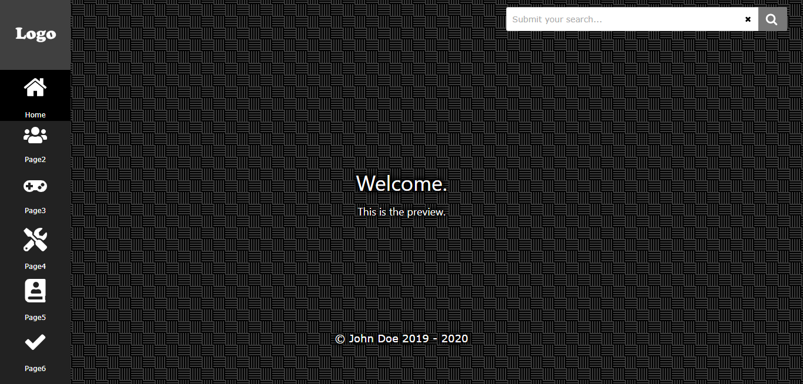

# PHP Dark Website Theme
A simple dark theme for a PHP website.

This theme is based off my personal website. https://saxobroko.com

# Table of Contents
- [Features](#Features)
- [Images](#Images)
- [Setup](#Setup)
- [License](#license)

# Features
- Loads Fast
- Easy to setup
- Allows implementation of ads and analytics
- SEO Optimized
- PWA Optimized
- Cookie Consent message
- Twitter and Facebook aswell as other social media intergration.
- Support for search with Google Custom Search
- Features automatically hide from pages if not set in config.php
- Sidebar
- Button to install as a PWA
- Dark Scrollbar on chrome-based browsers

# Images

# Setup
Setup is simple and requires the use of a single config.php which edits the data on every page of the website. If you are wanting to add more pages you should use the index.php as a guide.

## License

- **[MIT license](http://opensource.org/licenses/mit-license.php)**
- Copyright 2020 © <a href="https://saxobroko.com" target="_blank">Saxo_Broko</a>.
